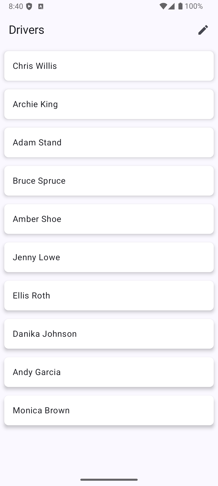
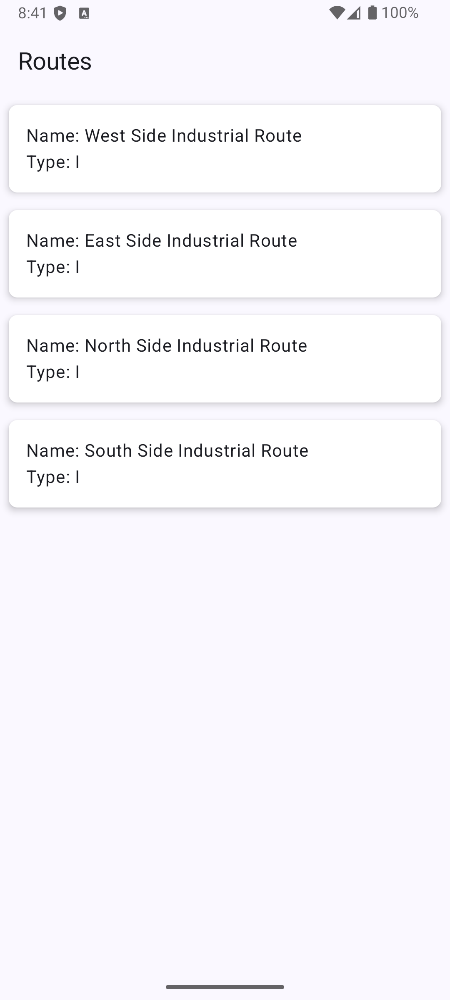

# Clean Architecture Flow


# Republic Services Android Take-Home Challenge

This Android application fulfills the requirements of the Republic Services Take-Home Challenge. It uses Clean Architecture principles, Jetpack libraries, and Kotlin to fetch, store, and display driver and route information.

## Screens




## Features

* **Driver Listing:** Displays a list of drivers from a local database.
* **Driver Sorting:** Allows users to sort drivers by last name.
* **Route Display:** Shows route information for a selected driver based on specific business logic.
* **Offline Support:** Data is stored locally, enabling offline access.

## Architecture

This project follows the Clean Architecture pattern, which separates the application into distinct layers:

* **Presentation Layer:** Contains UI-related components (Activities, ViewModels, Compose UI).
* **Domain Layer:** Holds the core business logic (entities, use cases, repositories).
* **Data Layer:** Manages data access (local database, remote API, mappers).

## Technologies

* **Kotlin:** Programming language.
* **Jetpack Compose:** Modern UI toolkit.
* **Hilt:** Dependency injection.
* **Room:** Local database persistence.
* **Retrofit:** Network communication.
* **Kotlin Coroutines & Flow:** Asynchronous operations and data streams.
* **Navigation Compose:** Navigation.


## Setup and Build

1.  **Clone the Repository:**
    ```bash
    git clone [repository_url]
    ```
2.  **Open in Android Studio:**
    * Open Android Studio and select "Open an existing Android Studio project."
    * Navigate to the cloned repository and select the `build.gradle.kts` file.
3.  **Sync Gradle:**
    * Android Studio will automatically sync the Gradle project. If not, click "Sync Project with Gradle Files."
4.  **Build and Run:**
    * Connect an Android emulator or physical device.
    * Click the "Run" button in Android Studio.

## Key Components

* **`DataRepository` and `DataRepositoryImpl`:** Handles data access from local and remote sources.
* **`GetDriversUseCase` and `GetRoutesUseCase`:** Encapsulates business logic for retrieving driver and route data.
* **`DriversViewModel` and `RoutesViewModel`:** Manages UI state and interacts with use cases.
* **`DriversScreen.kt` and `RoutesScreen.kt`:** Compose UI screens for displaying drivers and routes.
* **`AppDatabase`:** Room database for local data persistence.
* **`ApiService`:** Retrofit interface for remote API communication.
* **`Navigation.kt`:** Compose navigation.
* **`AppModule.kt`:** Hilt dependency injection module.

## Business Logic

The route display logic is implemented in the `GetRoutesUseCase`:

* If the driver ID is the same as the route ID, display the route.
* If the driver ID is divisible by 2, show the first "R" type route.
* If the driver ID is divisible by 5, display the second "C" type route.
* If the driver ID doesn't meet any of the above conditions, show the last "I" type route.

## Testing

* Unit tests are encouraged for the Domain and Data layers to ensure business logic and data access work as expected.
* UI tests can be implemented using Espresso or Compose UI testing.

## Future Improvements

* Add unit and UI tests.
* Implement error handling and loading states in the UI.
* Add pagination or infinite scrolling for large datasets.
* Improve UI/UX with better styling and animations.
* Add more robust data synchronization mechanisms.
* Implement a proper loading screen.

## Author

[Madhan Mohan Gangadhari]

## License
